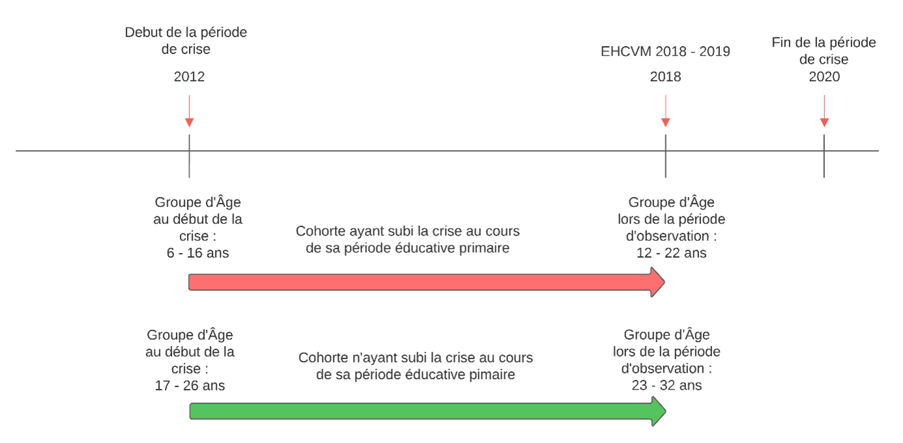

---

##### Download

+ [Paper](paper1.pdf)
+ [Online appendix](appendix1.pdf)
+ [Code and data](https://github.com/cae-ins/Conflict_Education_Mali)

---

##### Abstract

Cette étude, utilisant une méthodologie de double différence et des appariements par score de propension (PSMs), analyse l'impact causal des crises et des conflits prolongés au Mali sur le système éducatif malien. Les résultats indiquent que ces événements ont eu des conséquences significatives et négatives sur l'éducation, se traduisant par une baisse du nombre moyen d’années d’études entre les générations ayant fréquentés durant le conflit et la génération précédente allant de 0,16 à 1,97 années d’éducation. Ces conclusions soulignent l'urgence de prendre des mesures pour atténuer ces effets néfastes et rétablir un système éducatif fonctionnel dans le pays, mettant en évidence l'importance de comprendre l'impact causal des crises sur l'éducation au Mali.

---

##### Figure 1: Creation des cohortes suivies pour le diff-in-diff



---

##### Citation

Author. Year. "Title." *Journal* Volume (Issue): First page–Last page. https://doi.org/paper_doi.

```BibTeX
@article{AAYY,
author = {Author},
doi = {paper_doi},
journal = {Journal},
number = {Issue},
pages = {XXX--YYY},
title ={Title},
volume = {Volume},
year = {Year}}
```

---

##### Related material

+ [Presentation slides](presentation1.pdf)
+ [Dissertation title](https://escholarship.org/uc/item/7jr3m96r) – PhD dissertation on which this paper is based.
+ [Column title](https://cep.lse.ac.uk/pubs/download/cp365.pdf) – Nontechnical column describing the paper.

